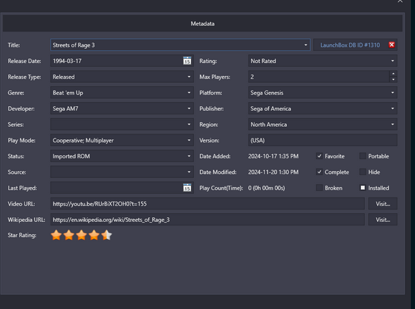

# Metadata Editor — design reference (LaunchBox "Edit Metadata")

Captured 2026-06-17 by the operator as the **north star for how per-game
metadata should be displayed and edited** in OA's Per-System Settings Hub
(`engine/systemsHub/domains/GameMetadataEditor.tsx` → `MetadataGamePane`).

This is **Wave-2** for the metadata editors (the editing arc itself closed +
merged 2026-06-14 — see [NEXT.md](../../NEXT.md) "✅ CLOSED — Metadata
Curation"). It is **not queued** yet; this doc just records the target so the
work can be picked up without re-deriving the design.

## What the operator likes about it

A **dense, two-column field grid** — every fact for a game visible and editable
on one neat panel, no scrolling, no nesting. Field label on the left, control on
the right; controls are a uniform mix of text inputs, dropdowns, date pickers,
and a compact checkbox cluster. A header row with the canonical **Title** + an
external-DB link (`LaunchBox DB ID #1310`) + a clear/unlink affordance (red ✕).
A **Star Rating** widget at the bottom, plus **Video URL / Wikipedia URL** rows
with "Visit…" buttons.

The "neat" quality is the point: tight vertical rhythm, aligned columns, grouped
checkboxes — it reads as a single scannable record, not a stack of accordions.

## Field inventory (reference → OA today)

OA's current per-game override shape (`GameMetadataOverride`, persisted in
`game_metadata_overrides` schema v24) carries: `year, developer, publisher,
genre[], players, region, rating, series`. The reference is broader. Gap map:

| Reference field | OA today | Notes / where it'd come from |
| --- | --- | --- |
| Title | ✅ `games.title` / identity canonical title | header field |
| Release Date | ⚠️ `year` only | reference uses a full date; we store year — widen to optional full date |
| Release Type | ❌ | new enum (Released / Prerelease / …); A2 filename tags carry some of this |
| Genre | ✅ `genre[]` | multi-value already |
| Developer | ✅ `developer` | |
| Series | ✅ `series` | |
| Play Mode | ❌ | new (Single / Cooperative / Multiplayer) |
| Status | ❌ | new (e.g. "Imported ROM") — OA could derive from launcher/source |
| Source | ❌ | new (provenance string) |
| Last Played | ✅ stat (`games.last_played`) | read-only stat, not an override |
| Rating (content) | ⚠️ `rating` (number) | reference "Not Rated" = **content/ESRB** rating, distinct from Star Rating — disambiguate our `rating` |
| Max Players | ✅ `players` | |
| Platform | ✅ `systemId` | factual, not an override |
| Publisher | ✅ `publisher` | |
| Region | ✅ `region` | |
| Version | ❌ | A2 filename-tag decode already extracts version/variant |
| Date Added | ✅ DB timestamp | read-only stat |
| Date Modified | ✅ DB timestamp | read-only stat |
| Play Count (Time) | ✅ stat (`play_time`) | read-only stat |
| Favorite | ✅ `games.favorite` | flag |
| Complete | ✅ `completed` | flag |
| Broken | ❌ | new flag |
| Portable / Hide / Installed | ➖ mostly N/A | LaunchBox-specific; OA has no analog for Portable/Installed; "Hide" could map to a future hidden flag |
| Video URL | ❌ | Game Info Panel v2 territory (scraper/data-repo) |
| Wikipedia URL | ❌ | same |
| Star Rating (1–5 ★) | ⚠️ `rating` (number) | likely **our** user star rating — settle whether `rating` is the star value or the content rating, then split if both are wanted |
| LaunchBox DB ID + ✕ | ➖ | OA's analog = the matched identity / external-DB id + an "unlink / clear override" control |

Legend: ✅ have · ⚠️ partial/ambiguous · ❌ missing · ➖ not applicable / OA-specific reframe.

## Implementation notes (for when this is queued)

- **Don't import LaunchBox semantics wholesale.** Portable/Installed/Source/
  Status are launcher-bookkeeping fields specific to LaunchBox's model; OA's
  equivalents (provenance, launcher, install state) live elsewhere. Take the
  **layout + completeness**, map fields to OA's data model, drop the rest.
- **Stats vs overrides.** Last Played / Date Added / Date Modified / Play
  Count are read-only stats (already aggregated per identity in the VL Phase E
  schema), shown but not editable — keep them visually distinct from the
  editable override fields.
- **Two ambiguities to settle first:** (1) is `rating` the **star rating** or a
  **content/ESRB rating**? The reference has BOTH as separate widgets. (2)
  Release Date wants a full date; we store `year`. Decide widen-vs-add.
- **Reuse, don't rebuild.** The Hub already has `PanelScaffold`, the spatial-nav
  panel primitives, and `metadataControls.tsx`; a denser grid is a layout pass
  over existing controls + a handful of new fields/flags, not a new surface.
- **Fields that need new backend columns** (Release Type, Play Mode, Status,
  Source, Version, Broken flag, Video/Wikipedia URL) would extend
  `game_metadata_overrides` — a schema bump, same pattern as v24.

## Status

📐 **Design reference only — not queued.** Logged in
[PARKING_LOT.md](../../PARKING_LOT.md) (2026-06-17) so it surfaces when
metadata-editor Wave-2 is picked up.
